# Data Cortex

**Turn existing data, APIs and agents into reusable, governed AI capabilities.** Cortex connects Microsoft Purview, Azure AI Search / Foundry IQ, Microsoft Foundry and Azure API Management through one application.

Ask a question or search the catalogue, build a data-backed agent, share an artefact, request an answer from a data holder, or compose a reviewed multi-agent workflow. Microsoft, Novo and Defra presentations share the same implementation, with separate application state.

> **Prototype, not a production certification.** Demo records are synthetic; connected Azure services and model usage are real. Catalogue visibility, workload permissions and tenant installation are different controls. A successful demo does not establish production security, regulatory compliance or full WCAG conformance.

## Current release

Last recorded deployment and rehearsal: **22 September 2026**, for the 23 September Novo demonstration. All three apps use `prdcoreamlacr001.azurecr.io/cortex/web-cortex:novo-demo-20260923-r3`. These are dated observations, not a continuous availability guarantee.

| Presentation | Application | Ready revision | State container |
|---|---|---|---|
| [Novo demo](https://cortex-web-novo.icybeach-1b7b9f0d.northeurope.azurecontainerapps.io) | `cortex-web-novo` | `0000014` | `state-cortex-web-novo` |
| [Microsoft](https://cortex-web-microsoft.icybeach-1b7b9f0d.northeurope.azurecontainerapps.io) | `cortex-web-microsoft` | `0000017` | `state-cortex-web-microsoft` |
| [Defra](https://cortex-web.icybeach-1b7b9f0d.northeurope.azurecontainerapps.io) | `cortex-web` | `0000032` | `state` |

The full original Novo About content is preserved. Theme changes do not create separate tenants or isolated backend estates.

## Technical solution architecture

Solid arrows show application/data paths. Dashed arrows show configuration, deployment, governance or conditional integrations. The diagram does **not** imply that all optional services or controls are enabled.

```mermaid
flowchart TB
  People["Users and demo presenter"] --> Entra["Microsoft Entra ID<br/>Container Apps authentication + group claims"]

  subgraph Runtime["Azure Container Apps environment: cae-cortex"]
    Web["Cortex Node.js 20+ BFF + server-rendered UI<br/>cortex-web / cortex-web-microsoft / cortex-web-novo<br/>Ask, discover, build, share, requests, chat, workflows"]
    CatalogMCP["cortex-purview-mcp<br/>Catalogue metadata tools"]
    Job["Manual bootstrap job / approved operator scripts<br/>Not an automatic reset or deployment trigger"]
  end
  Entra --> Web
  Web --> Foundry["Microsoft Foundry<br/>gpt-5.4-mini deployment<br/>Versioned agents + Responses API"]
  Web --> UC["Microsoft Purview Unified Catalog<br/>Domains, products, ownership, access metadata"]
  Web --> Map["Microsoft Purview Data Map<br/>Scanned assets, schemas, classifications"]
  Foundry --> CatalogMCP --> UC

  subgraph Grounding["Physical data to Foundry IQ"]
    Data["Azure Storage / ADLS Gen2<br/>stcortexdatazha7pf / products<br/>14 synthetic CSV datasets"]
    Indexer["Azure AI Search<br/>Data sources + CSV indexers"]
    Index["14 Search indexes<br/>15,050 verified rows"]
    IQ["Foundry IQ on Azure AI Search<br/>Knowledge sources + knowledge bases<br/>MCP retrieval; configured query planning"]
    Data --> Indexer --> Index --> IQ
  end
  Map -. "Scans and links physical assets" .-> Data
  UC -. "Records asset, index and knowledge connection" .-> IQ
  Foundry -->|"Project-managed-identity MCP connection"| IQ
  IQ -->|"Search identity invokes existing planning model"| Foundry
  Job -. "Uploads, scans, indexes and links" .-> Grounding

  Web --> APIM["Azure API Management<br/>REST / GraphQL APIs + inline MCP tools<br/>Gateway subscriptions and usage"]
  Foundry -->|"Per-target authenticated tool connection"| APIM
  APIM -->|"Cortex invocation shims"| Web
  Web --> Connectors["Approved connector adapters<br/>Fixed origins, credentials kept server-side"]
  Connectors --> DBX["Azure Databricks<br/>Existing serving endpoint: rehearsed live"]
  Connectors -. "Tenant prerequisites" .-> Fabric["Microsoft Fabric data agent<br/>MCP connector: model-policy blocker"]
  Connectors -. "Environment prerequisites" .-> Studio["Copilot Studio<br/>Direct Engine / secured Direct Line<br/>App-only S2S blocker in this environment"]

  Web --> State["Azure Blob Storage<br/>stcortexstatezha7pf<br/>Separate state container per app<br/>Single writer; transcripts, artefacts, drafts, evidence"]
  Web --> Assurance["Responsible AI / NIST configuration review<br/>axe-core WCAG checks + manual attestations"]
  Web --> Evals["Foundry native Evals + taxonomy service<br/>Version-pinned agent assessment<br/>Hosted ACA-session 429 blocker"]
  Web --> Package["Teams / Microsoft 365 app ZIP<br/>Manifest, icons, installation instructions"]
  Package -. "Separate provisioning, consent and installation" .-> Bot["Azure Bot Service + Foundry Activity Protocol<br/>Teams / Microsoft 365 Copilot<br/>Conditional; installation not rehearsed"]

  subgraph Foundation["Identity, operations and deployment foundation"]
    MI["User-assigned Cortex identity<br/>Service/project identities + scoped RBAC"]
    Secrets["Container Apps secrets + direct configuration<br/>Key Vault adapter / existing vault where reachable"]
    NSP["Azure Network Security Perimeter<br/>Storage: Enforced; Search: Learning<br/>Not a blanket private-endpoint claim"]
    Logs["Azure Monitor / Log Analytics<br/>Container logs<br/>Application Insights configuration available"]
    IaC["Azure CLI + azd + Bicep<br/>infra/main.bicep"]
    ACR["Azure Container Registry<br/>Locked npm dependencies + immutable release tags"]
  end
  MI -. "Service authentication" .-> Web
  MI -. "Data access" .-> Grounding
  Secrets -. "Server-only settings" .-> Web
  NSP -. "Network policy" .-> Data
  NSP -. "Network policy" .-> State
  NSP -. "Learning-mode association" .-> Indexer
  Web -. "Logs" .-> Logs
  IaC -. "Create or reuse reviewed resources" .-> Runtime
  IaC --> ACR -. "Images" .-> Runtime
```



**Data is genuinely indexed.** Purview describes and links assets; Search indexers read the associated CSV files, create derived index copies, and expose knowledge retrieval to Foundry. The catalogue itself is not the underlying dataset. A private Blob container URL is not a browsable file listing.

**Infrastructure is explicit.** The sandbox uses existing Foundry/Purview resources in East US and Cortex hosting, storage and Search in North Europe. Review cross-region processing and residency before reuse. Key Vault and Application Insights are supported by infrastructure/configuration; this does not claim that every app reads Key Vault at runtime or emits complete distributed traces. Cosmos DB is not the current state store. See [architecture details](docs/ARCHITECTURE.md).

## What works, and what remains conditional

| Capability | Current implementation and evidence |
|---|---|
| Discovery | One Ask/Search entry with an override; live catalogue filters, Map and declared lineage; old `/marketplace` URLs remain compatible |
| Data-backed agents | Five analyst/reviewer blueprints; real indexed SYN-17 values retrieved through Foundry IQ; private owner-scoped chat with an accessible bottom-right dialog |
| Publishing | Configured CSV sources to Foundry IQ; selected REST and fixed GraphQL queries to MCP; actual Databricks delegation; Teams/Microsoft 365 ZIP generation |
| Automation | Editable AI proposals; one to five steps, at most three in parallel; all-success joins; structured evidence handoff; manual demo runs |
| Requests and Help | Holder-supported requests with preserved input; documentation-grounded, tool-free guide assistant; no automatic access grant |
| Assurance | Microsoft Responsible AI / NIST mappings, current-version scan evidence, browser axe checks and manual review records; advisory publishing requires explicit acknowledgement |
| External prerequisites | Native red-team runs blocked before sampling by hosted ACA-session 429; Fabric connector model-policy and Studio S2S restrictions remain; tenant channel installation and manual WCAG sign-off are not completed claims |

The live Novo workflow completed all five steps in approximately 37 and 53 seconds. Those are rehearsal timings, not latency guarantees. See [the presenter script](docs/DEMO.md) for exact prompts, expected values and fallback wording.

## Developer start

Requires Node.js 20+, npm and PowerShell 7 for the Windows operator scripts. Azure CLI/azd and resource access are needed only for live operations.

```powershell
npm ci
npm test
node .\scripts\bootstrap.js --dry-run
node .\scripts\bootstrap-demo.js
node .\scripts\sample-data.js --list
```

Tests stub Azure; the bootstrap dry runs do not mutate cloud resources. Browser tests use `playwright-core` with an installed Edge/Chromium executable (`CORTEX_BROWSER_EXECUTABLE` overrides the Windows default). The application itself has **no offline demo mode**.

For live local development, follow [the isolated local-state instructions](docs/DEPLOY.md#local-development). Do not copy a deployed state-container setting into a second writable app instance.

## Deployment and reproducible demo data

`azure.yaml` deploys the base `web` and `purview-mcp` services; it does not automatically align both themed variants or the manual bootstrap job. `infra\main.bicep` is the active infrastructure entry point. The root `containerapps.bicep` is a legacy template, not the azd entry point.

Bootstrap stages are **catalogue -> sample files/scan -> asset links -> indexes -> knowledge connections -> demo agents/workflow**, with APIM skills/connections alongside them. Source and knowledge setup must be verified before agent creation. Use [DEPLOY.md](docs/DEPLOY.md), not an unreviewed full deployment, for an existing estate.

**Reset is a separate destructive operation.** Maintenance, verified backups, explicit object review and confirmation hashes are mandatory. The latest approved refresh deleted 313 objects and retained 18 provider-side evaluation/taxonomy records; no historical approval authorizes another reset. Do not use the infrastructure-level `Deploy-Cortex.ps1 -Reset` for content cleanup.

## Documentation map

| Document | Audience and purpose |
|---|---|
| [Architecture](docs/ARCHITECTURE.md) | Technology, infrastructure, trust boundaries, data flows and API contracts |
| [Deployment runbook](docs/DEPLOY.md) | Configuration, safe rollout, bootstrap, maintenance, reset and troubleshooting |
| [Developer handover](docs/HANDOVER.md) | Code ownership, implementation invariants and next-engineer guidance |
| [Demo script](docs/DEMO.md) | Presenter walkthrough and dated live rehearsal evidence |
| [Change report](CHANGES.md) | Current release and explicitly historical changes |
| [Integration lessons](FIXES.md) | Failure signatures, root causes and safe remedies |
| [Historical documentation index](docs/CHANGES.md) | Superseded notes and the current sources of truth |
